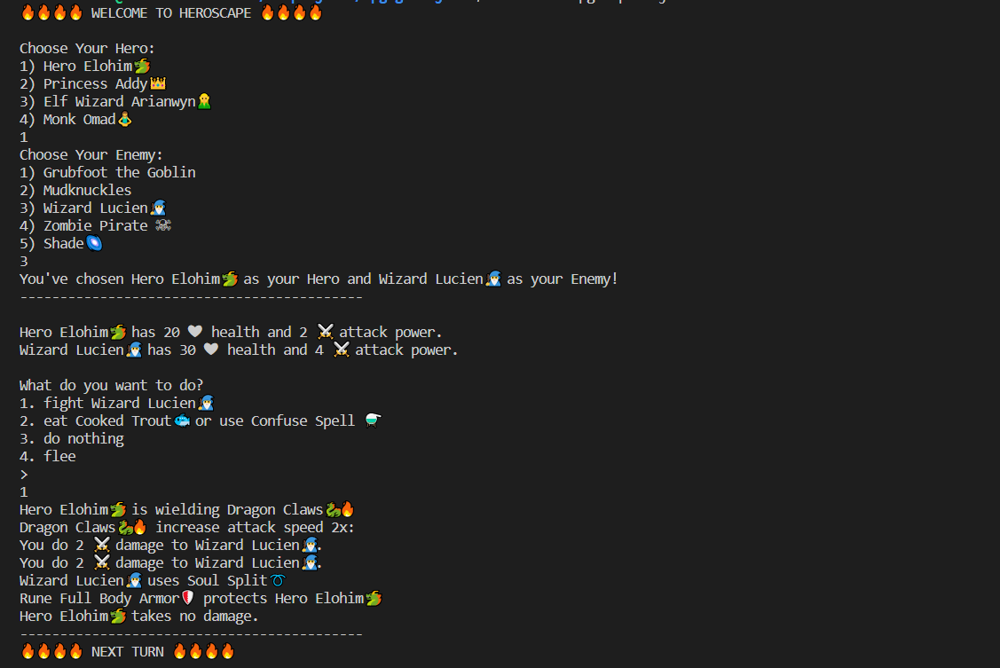

# 🔥 WELCOME TO HEROSCAPE 🔥
This is an RPG Game made with Javascript using Object Orient Programming. Enjoy!

## GAME & CHARACTER NOTES (Please See Here):
### Heros:
1. Hero Elohim🐲 
-  Weapon: Dragon Claws🐉🔥
-  Armor: Rune Full Body Armor🛡️ 

2. Princess Addy👑
-  Weapon: Poisin Dagger 🗡️🩸
-  Weapon: Secret Weapon 🧪 (used against Zombie)
-  Armor: Graceful Cloak🦸

3. Elf Wizard Arianwyn🧝‍
-  Attack Ability: 50% chance of Fire Wave🔥 Spell (Zombie is vulnerable to fire)
-  Attack Ability: 50% chance of Water Wave🌊 Spell
-  Armor: Graceful Cloak🦸

4. Monk Omad🧘‍
-  Healing Ability: Heal +2 ❤ health ~20% of turns
-  Armor: Graceful Cloak🦸

### Enemies:
1. Grubfoot the Goblin
2. Mudknuckles
3. Wizard Lucien🧙‍
4. Zombie Pirate ☠ 
5. Shade🌌

#### Items:
1. Cooked Trout 🐟 (increase +7 ❤ health)
2. Confuse Spell ⚗️ (decreases enemy accuracy by 50%)

#### Weapons:
1. Dragon Claws🐉🔥 (increases attack speed 2x)
2. Poisin Dagger 🗡️🩸 (poisons enemy: -1 health each turn)
3. Mortality Elixir 🧪 (secret potion from Princess Addy's kingdom)

#### Armor:
1. Rune Full Body Armor🛡️ (protects Hero 50% of the time)
2. Graceful Cloak🦸 (protects Hero 25% of the time)
3. Agility Boots🥾 (Hero quickly equips if trying to flee)

#### Gameplay:

## OOP RPG Game Assignment Notes:
In this exercise, you will develop a hero RPG (*Role Playing Game*) using all of the cool new javascript knowledge you've acquired. This game will be created using **Object Oriented Programming**.

In this exercise, you will develop a hero RPG (*Role Playing Game*) using all of the cool new python knowledge you've acquired. This game will be created using **Object Oriented Programming**.

The game starts off with 2 characters: a `hero` and a `goblin`. Each character will be given a starting health and starting value. 

Each character also has a power that can be used to attack their opponent. In the initial scenario, the `hero's` opponent is the `goblin`, and the `goblin's` opponent is the `hero`.

When either character attacks his/her opponent, the opponent's health will decrease by the amount of power of the attacking character.

For example
>
>If the hero starts off with the following: 
>
>- health = 9
>- power = 4
>
>And the `goblin` starts off with the following:  
>
>- health = 7
>- power = 3
>
>Then when the hero attacks the goblin, the goblin's health will decrease by 4.
>
>The result of goblin's health after being attacked
>
>- health = 3  ==> (7 - 4)
>- power = 3
>

## RPG Game Part 1

Follow the link below to continue building new characters with new abilities to your game.

- [RPG Part 1](./RPG-Part1.md)

## RPG Game Part 2

Follow the link below to continue building new characters with new abilities to your game.

- [RPG Part 2](./RPG-Part2.md)

Emoji Resource: https://emojigraph.org/ 
